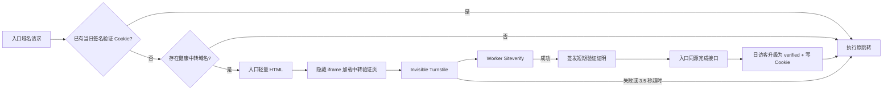

# Turnstile 验证流量与系统加固设计

日期：2026-07-15

状态：待用户审核

范围：设计文档，不包含本轮代码修改或生产部署

## 1. 决策摘要

本次更新采用以下已确认决策：

- 从现有“按请求推测访客”升级为三种明确口径：原始请求数、服务器过滤 UV、Cloudflare 验证 UV。
- “一个 IP 在一个入口域名下，无论访问多少路径或资源，在上海自然日内只计一个 UV”。
- 选择少数已接入本 Worker 的目标服务域名作为“无感验证中转域名池”。
- 入口页面通过隐藏 iframe 在中转域名上运行 Cloudflare Turnstile Invisible Widget，地址栏不切换到中转域名。
- 验证成功才增加“Cloudflare 验证 UV”；验证失败、超时或中转不可用时继续原跳转，但不增加验证 UV。
- 中转验证默认最多等待 3.5 秒，达到上限立即 fail-open。
- 所有批量新增、删除、修改操作继续由前端逐项发送，同时增加服务端全局串行队列和可恢复租约，防止多标签页或 Cron 并发。
- 本次同时修复此前代码审查发现的统计、队列、Cloudflare 自动化、健康检查、前端轮询、D1 性能和认证安全问题。

Turnstile Invisible 模式不会显示 Widget 或要求访客操作。客户端获得的 Token 必须在服务端调用 Siteverify 验证；Token 有效期为 300 秒且只能使用一次。参见 [Turnstile Widget 模式](https://developers.cloudflare.com/turnstile/concepts/widget/) 和 [Siteverify 服务端验证](https://developers.cloudflare.com/turnstile/get-started/server-side-validation/)。

## 2. 背景与当前问题

当前统计已实现按日去重，但仍有明显偏大，根因不是简单的 SQL 重复累加，而是大量自动扫描、探测路径、监控程序和伪装浏览器请求被识别为访客。只依靠 URL、User-Agent 和请求头无法证明请求来自真人浏览器。

当前实现还存在以下已确认风险：

- `GET`/`HEAD`、路径和静态资源过滤只能排除一部分请求，无法排除伪装成普通浏览器的扫描器。
- 已知 Bot 在进入 `recordVisit` 前就被过滤，导致 `is_bot` 分类字段几乎无法记录真实拒绝原因。
- 访客键包含 User-Agent，和“同一 IP 每个域名每天只计一次”的产品口径不完全一致。
- 日期使用 UTC，会把北京时间 00:00 至 08:00 计入前一天。
- 地理、来源、设备等维度可能按原始事件统计，而总流量按 UV 统计，导致各面板分母不一致。
- 短链接计数与入口域名统计没有完全共享同一套去重和 Bot 判定逻辑。
- `visit_events` 对大量请求逐条写入，D1 存储与查询成本持续上升。
- D1 操作锁不是可靠的持久队列；多个标签页、Cron 和手动重试仍可能并发。
- 永久失败任务可能长期占据最旧队列位置，阻塞后续可执行任务。
- Cloudflare DNS 只判断记录是否存在，没有严格校验内容与 `proxied`；Worker Route 只看 pattern，没有核对目标脚本。
- 目标服务健康检查在数据库状态看起来正常时可能跳过真实 HTTP 验证，产生假绿色。
- 前端轮询 Effect 依赖并更新同一个结果数组，可能形成高频重复轮询。
- 登录密码使用快速 SHA-256，无盐、无登录限速；服务端设置中的第三方 Token 缺少应用层加密。

## 3. 目标与非目标

### 3.1 目标

- 提供可解释、可核对的服务器过滤 UV 与 Cloudflare 验证 UV。
- 扫描器访问任意路径或伪装静态资源时，不得增加验证 UV。
- 验证系统故障不得阻断原跳转业务。
- 大量入口域名只使用少数 Turnstile hostname，避免逐个配置入口域名。
- 入口域名、直接跳转、目标服务二段跳和短链接使用同一套统计基础设施。
- 所有 Cloudflare/Dynadot 变更具有串行、幂等、可重试和清晰错误状态。
- 生产迁移可灰度、可关闭、可回滚，不伪造历史验证数据。

### 3.2 非目标

- 不宣称 Turnstile 验证等于法律或生物意义上的“100% 真人”。UI 使用“Cloudflare 验证 UV”。
- 不复制 Bodis、ParkingCrew 的私有风控算法。
- 不在本次引入多用户、团队或角色权限。
- 不将 Sink 的 AGPL-3.0 源代码直接复制进本项目；只参考其分析界面结构和统计维度，避免许可证边界不清。参考：[miantiao-me/Sink](https://github.com/miantiao-me/sink)。
- 不在本次强制购买 Cloudflare Enterprise Bot Management。

## 4. 统计口径

### 4.1 原始请求数

`request_count` 表示 Worker 收到的请求总量，只用于诊断容量、扫描和异常，不再显示为“访问人数”。路径探测、静态资源、HEAD、Bot 和预取请求均可能包含在内。

### 4.2 服务器过滤 UV

满足以下条件的首次请求计入 `filtered_uv`：

- 方法必须是 `GET`。
- 请求表现为顶层 HTML 导航；明确的图片、脚本、样式、字体、预取和社交预览请求排除。
- 已知 Bot、扫描器、监控器、空 User-Agent 和高风险探测路径排除。
- 按 `入口域名配置 ID + Asia/Shanghai 日期 + HMAC(IP)` 唯一。

服务器过滤 UV 仍是估算值，可能包含高级扫描器，也可能因 NAT 把多名用户合并为一个 UV。

### 4.3 Cloudflare 验证 UV

访客完成 Turnstile，并通过服务端 Siteverify 后，将同一条日访客记录升级为 `turnstile_verified`。同一个 IP 对同一个入口域名在同一上海自然日最多贡献一个验证 UV。

历史数据无法补算验证结果：上线日前 `verified_uv` 必须为 0，不允许把旧的过滤 UV 标记成已验证。

### 4.4 短链接

短链接按 `短链接 ID + Asia/Shanghai 日期 + HMAC(IP)` 去重。列表中的“访问量”默认显示过滤 UV；启用验证后同时显示验证 UV。原始请求数只在详情诊断区展示。

### 4.5 分析维度

国家、地区、城市、来源、语言、系统、浏览器和设备均取“该 IP 当天第一次被接受的访问”作为日访客事实。所有百分比必须使用当前选择的 UV 口径作为分母，不能再按原始事件数量计算。

地理地图使用 ISO 3166-1 alpha-2 国家代码映射真实世界 GeoJSON，绘制国家分级着色图；不再用近似坐标拼接成抽象轮廓。地区和城市以右侧列表呈现，不暗示 IP 定位是精确地理位置。

## 5. 已比较的架构

### 5.1 每个入口域名直接加载 Turnstile

优点是链路最短。缺点是 Turnstile 免费版每个 Widget 最多配置 10 个 hostname，且不支持 hostname 通配符；大量独立入口域名会产生明显维护成本。参见 [Turnstile 套餐](https://developers.cloudflare.com/turnstile/plans/) 和 [Hostname 管理](https://developers.cloudflare.com/turnstile/additional-configuration/hostname-management/)。

### 5.2 整页跳转到统一验证域名

实现最简单，Turnstile 在第一方页面执行。但地址栏会短暂显示验证域名；若验证域名本身无法访问，浏览器无法返回入口页执行 fail-open。

### 5.3 入口页内嵌中转验证（已选）

入口 Worker 返回轻量 HTML，页面在隐藏 iframe 中加载中转域名验证页。验证成功后 iframe 使用 `postMessage` 返回短期签名证明；入口页向同源完成接口提交证明、写入验证 UV 和签名 Cookie，然后执行原跳转。超时或任何错误直接执行原跳转。

该方案满足：

- Turnstile 只配置少数中转 hostname。
- 地址栏不会出现验证中转域名。
- 中转加载失败时入口页仍能执行 fail-open。
- 原有直接跳转和二段跳语义保持不变。

Cloudflare 官方文档说明 Turnstile 可嵌入 HTTP/HTTPS 页面，并由自身 iframe 执行挑战，但没有明确承诺所有“第三方页面中的嵌套 iframe”组合。实施必须先用 Cloudflare 测试 key 和生产 key 完成技术验证，覆盖 Chrome、Edge、Safari、Firefox、移动端、严格隐私模式和第三方 Cookie 禁用。若任一主流组合无法稳定获得 Token，则停止该架构上线，改回 5.2 的整页中转并再次由用户确认。

## 6. 总体架构



### 6.1 中转域名池

- 中转域名从已经接入本 Worker 的“目标服务域名”中选择，不新增另一套 Cloudflare Zone 接入逻辑。
- 每个中转域名有 `enabled`、`priority`、`health_status`、`last_checked_at` 和 `last_error`。
- Relay 健康检查使用保留路径 `/.well-known/link-verify/health`，Worker 返回 `204`。
- Cron 定期检查 DNS、Route、TLS、保留健康端点和 Turnstile hostname 配置状态。
- 入口请求从 `healthy` 中转中按稳定哈希分配；禁用、失败或检查过期的中转不参与选择。
- 一个 Turnstile Widget 支持最多 10 个中转 hostname；V1 使用一个全局 Widget。超过 10 个时应减少中转数量或在后续版本支持多 Widget。

### 6.2 全局与单项策略

- 全局设置：`verification_global_mode = off | enabled`，迁移后默认 `off`。
- 入口域名：`verification_policy = inherit | always | never`。
- 短链接：`verification_policy = inherit | always | never`。
- 配置至少一个健康中转并完成测试后，再将全局模式切换为 `enabled`。
- 中转域名自身访问保留验证路径，不递归进入验证流程。

### 6.3 当日 Cookie

验证完成后，入口域名设置签名、`Secure`、`HttpOnly`、`SameSite=Lax` Cookie，有效期到下一个上海自然日。Cookie 仅用于跳过重复 Turnstile，不作为统计真相；数据库唯一约束仍负责最终去重。

根域名及其子域共享 Cookie 时使用 `__Secure-` 前缀和受控 `Domain` 属性。Cookie 内容不包含原始 IP、目标 URL、Turnstile Token 或 API 密钥。

## 7. 验证协议与安全边界

### 7.1 短期状态令牌

入口页签发 60 秒有效的 HMAC 状态令牌，包含：

- `subject_type`：`redirect_domain` 或 `short_link`
- `subject_id`
- 上海日期
- `visitor_key = HMAC(VISITOR_HASH_SECRET, normalized_ip)`
- 签发时间、过期时间
- 随机 nonce

状态令牌不包含明文 IP 和服务端密钥。

### 7.2 Relay 验证

Relay 验证页在自身 hostname 上运行 Invisible Turnstile，`action` 固定为 `redirect_verify`。Relay 服务端必须校验：

- Siteverify `success === true`
- 返回的 `hostname` 等于当前启用的中转 hostname
- `action === redirect_verify`
- Token 未过期且未重复使用
- 状态令牌签名、有效期、subject 和 visitor key 均匹配

`TURNSTILE_SECRET_KEY` 只存在于 Worker Secret，不写 D1、不返回前端、不写日志。

### 7.3 验证证明

Relay 返回 60 秒有效的 HMAC 证明，绑定 subject、上海日期、visitor key 和 relay hostname。入口完成接口重新计算当前请求的 visitor key；证明不匹配时拒绝升级 UV，但仍允许页面执行 fail-open 跳转。

证明被同一 IP 重放只会命中数据库唯一键，不会增加 UV。证明被其他 IP 分享会因 visitor key 不匹配而失败。

### 7.4 iframe 通信

入口页必须同时校验：

- `event.origin` 等于选中的 relay origin
- `event.source` 等于当前 iframe window
- 消息 schema、证明长度和状态值合法
- 每个页面只接受第一次终态消息

iframe 使用 `referrerpolicy="no-referrer"`，避免入口域名泄露给中转日志。父页面是否对最终目标隐藏 Referer，继续服从每条跳转的“隐藏 Referer”配置。

### 7.5 Fail-open

- 页面总等待上限：3.5 秒。
- Relay Siteverify 子请求超时：2.5 秒。
- 脚本加载失败、iframe 加载失败、Siteverify 失败、签名失败、D1 写入失败和无健康 Relay 均不阻断最终跳转。
- Fail-open 不增加验证 UV；仅增加按日聚合的验证失败/超时计数。
- 页面提供最小 `<noscript>` 跳转链接，禁用 JavaScript 的访客可以继续访问，但不计验证 UV。

### 7.6 隐私说明

Cloudflare 要求使用 Invisible 模式的网站在自己的隐私政策中引用 Turnstile Privacy Addendum。初始化检查和部署文档必须显示该要求；启用全局验证前由管理员确认已更新隐私说明。验证页面不保存 Turnstile Token、明文 IP 或可跨站追踪的长期标识。

## 8. 与现有跳转模式的关系

### 8.1 直接跳转

```text
入口域名 -> 隐藏 relay iframe 验证 -> 任意最终 URL
```

### 8.2 目标服务二段跳

```text
入口域名 -> 隐藏 relay iframe 验证 -> 原目标服务域名 -> 任意最终 URL
```

验证步骤不改变目标服务二段跳语义。目标服务域名继续负责第二段跳转。

### 8.3 短链接

```text
目标服务域名/短码 -> 隐藏 relay iframe 验证 -> 原始 URL
```

如果当前短链接 hostname 本身是健康 Relay，可直接在当前页面运行 Turnstile，减少一次 iframe 域名切换；统计与证明流程保持一致。

直接跳转、目标服务二段跳和短链接的“隐藏 Referer”继续默认开启。关闭后只是不主动设置 `no-referrer`，浏览器仍可能根据自身策略省略 Referer，UI 保留该提示。

## 9. 数据模型设计

本次使用新增表和新增列，避免破坏现有历史数据。

### 9.1 `verification_relays`

- `id`
- `target_service_id`，唯一
- `enabled`
- `priority`
- `health_status`
- `last_error`
- `last_checked_at`
- `created_at` / `updated_at`

### 9.2 `traffic_daily_visitors`

统一保存入口域名和短链接的日访客事实：

- `subject_type`
- `subject_id`
- `day`
- `visitor_key`
- `classification = server_filtered | turnstile_verified`
- `first_seen_at`
- `verified_at`
- `referer_host`
- `country` / `region` / `city` / `timezone`
- `language` / `operating_system` / `browser` / `device_type`
- 主键：`subject_type + subject_id + day + visitor_key`

首次过滤通过时插入；Turnstile 成功时用幂等 UPSERT 升级 `classification`，不得降级。

### 9.3 `traffic_daily_stats`

- `subject_type`
- `subject_id`
- `day`
- `request_count`
- `filtered_uv`
- `verified_uv`
- `rejected_request_count`
- `verification_attempts`
- `verification_passed`
- `verification_failed`
- `verification_timed_out`
- `last_accessed_at`

该表用于列表和摘要快速查询；数值必须可以从 `traffic_daily_visitors` 和聚合诊断计数重建。

### 9.4 现有表调整

- `redirect_domains` 增加 `verification_policy` 和 `activated_at`。
- `short_links` 增加 `verification_policy`。
- `target_services` 不直接保存 Turnstile Secret。
- 现有 `visit_events` 停止记录每个原始请求，只保留迁移期历史读取；30 天后分批清理。
- 现有 `visit_daily_uniques`、`short_link_daily_uniques` 和 `visit_daily_stats` 在过渡期只读，验证新统计稳定后再停止 UI 查询。

### 9.5 历史迁移

- 数据库 schema 迁移只创建表、索引和列，不在发布请求中执行全量重算。
- 后台维护任务按日期和主键分页，把旧的过滤 UV 与第一条事件维度迁移到新表。
- 历史数据一律标记为 `server_filtered`。
- 上线前日期的 `verified_uv` 保持 0。
- 迁移完成前 UI 可显示“历史过滤口径”；不能把两套口径混成同一条曲线。

## 10. 公共路由与管理 API

入口域名继续禁止访问 `/api/*`。验证使用保留的非管理路径：

- `GET /.well-known/link-verify/frame`：仅 Relay hostname 返回验证 iframe 页面。
- `POST /.well-known/link-verify/siteverify`：仅 Relay hostname 接收 Turnstile Token。
- `POST /.well-known/link-verify/complete`：仅入口/短链 hostname 接收签名证明并设置 Cookie。
- `GET /.well-known/link-verify/health`：仅目标服务/Relay hostname 返回 Worker 健康状态。

管理端新增：

- `GET /api/verification/settings`
- `PATCH /api/verification/settings`
- `GET /api/verification/relays`
- `POST /api/verification/relays`
- `PATCH /api/verification/relays/:id`
- `DELETE /api/verification/relays/:id`
- `POST /api/verification/relays/:id/check`
- `GET /api/operations/:id`
- `POST /api/operations/:id/retry`

所有管理写接口继续要求管理员 Session，并增加 Origin/CSRF 校验。

## 11. 管理后台设计

### 11.1 初始化检查

新增“Cloudflare 验证流量”检查项：

- Turnstile Sitekey 已配置
- Turnstile Secret 已配置，仅显示“已配置/未配置”
- Visitor Hash Secret 已配置
- Verification Signing Secret 已配置
- 至少一个 Relay hostname 在 Widget 允许列表中
- Relay DNS、Route、TLS 和健康端点正常
- Invisible Turnstile 隐私说明已人工确认

保留退出登录按钮、修改密码和手动配置说明。

### 11.2 目标服务列表

- 每个可用目标服务增加“作为验证中转”开关。
- 显示 `可用 / 检查中 / 失败 / 已停用`。
- 信息弹窗显示 hostname、健康路径、Turnstile hostname 要求、最近检查与错误原因。
- 保留手动“重新检查/重新自动配置”按钮。
- 自动修复失败时，“手动配置”弹窗逐项给出 Cloudflare 分配的 Nameserver、需要创建或修正的 `@`/`*` DNS 记录、`proxied` 状态、Worker Route pattern 和目标脚本名，并提供复制按钮。
- 删除作为 Relay 的目标服务时必须二次确认，并先从 Relay 池停用；依赖入口域名仍按 fail-open 跳转。

### 11.3 域名列表与详情

- 列表新增“统计验证”列：`继承 / 已验证 / 仅过滤 / Relay 不可用`。
- 摘要卡片明确写成“入口域名数、可用入口域名、异常/配置中、过滤 UV、验证 UV”。
- 详情页提供 `验证 UV / 过滤 UV / 请求数` 分段控制，默认优先显示验证 UV。
- 最近访问改成“最近日访客”，同一个 IP 当天只出现一条，不再列出每个扫描路径。
- 地图、来源、语言、设备等面板全部跟随当前 UV 口径。

### 11.4 批量操作结果

- 处理结果继续持久保留到用户手动清空。
- 显示总数、已处理、成功、失败、处理中。
- 每个失败或超时项提供手动重试按钮和可复制错误详情。
- 前端每次只发送一个项目，等待明确成功/失败/超时后才处理下一个。
- 未曾成功激活的入口域名不进入域名列表或摘要统计；曾经激活、后来因目标服务删除等原因异常的域名继续留在列表并显示原因。

## 12. 当前代码修复清单

### P0：统计正确性

1. 将访客键改为仅 HMAC 规范化 IP，满足“一 IP/域名/日一次”的已确认口径；不保存明文 IP。
2. 所有日界线统一使用 `Asia/Shanghai`，数据库保存 UTC 时间戳但显式计算上海日期。
3. 统一入口域名和短链接的请求分类器、Bot 分类器和日去重写入器。
4. 只把顶层 `GET` 导航作为过滤 UV 候选；HEAD、预取、资源和社交预览不计 UV。
5. Bot 分类在写入前返回结构化原因；拒绝请求只增加聚合诊断数，不再伪装成普通访客事件。
6. 地理、来源、语言、系统、浏览器和设备按日访客事实统计，保证分母一致。
7. 验证 UV 只由成功 Siteverify 升级，不允许前端 Token 或 Cookie 直接增加。
8. UI 中不再把“请求数”称为流量或访问人数。

### P0：队列与操作可靠性

1. 新增持久 `operation_queue`，所有 Zone、DNS、Route、NS、目标服务修复和删除操作先进入队列。
2. 新增单例 `operation_mutex`，使用条件 UPDATE 获取带过期时间的租约，避免现有“先查再写”锁竞争。
3. 每次 Worker invocation 最多执行一个域名的一步或一个小型幂等操作，完成后持久化状态。
4. `queuedJobs` 只选择 `queued` 或到达 `next_attempt_at` 的 `retryable`，永久失败不再占据队首。
5. 429、5xx 和网络超时使用指数退避与抖动；尊重 Cloudflare `Retry-After`。
6. 每个操作设置幂等键；重复点击、前端重试或 Cron 重放不得重复创建 DNS/Route 或误删资源。
7. 前端串行仍然保留，但服务端串行是最终保障。

Workers Free 当前每次请求最多 50 个 subrequest，Paid 默认 10,000；限制属于单次 Worker invocation，不是某个域名的独立配额。Cloudflare API 还有账户级速率限制，因此拆分请求不能替代退避。参见 [Workers Limits](https://developers.cloudflare.com/workers/platform/limits/) 和 [Cloudflare API Rate Limits](https://developers.cloudflare.com/fundamentals/api/reference/limits/)。

### P0：Cloudflare/Dynadot 自动化

1. Zone 已存在时复用并校验账户归属，不把“已存在”当错误。
2. Nameserver 已匹配时标记完成，不重复调用 Dynadot。
3. DNS `@` 与 `*` 必须同时校验 type、name、content 和 `proxied=true`；错误记录执行更新，不只判断存在。
4. Worker Routes 必须同时校验 pattern 与 script；指向其他 Worker 时更新或给出明确冲突。
5. 每一步保存 Cloudflare request id、HTTP 状态和脱敏错误码，前端显示中文说明。
6. Dynadot `was expired` 映射为“域名已过期，注册商拒绝修改 NS”，归类为不可自动重试，并展示续费后的手动重试按钮。
7. 批量删除 Zone 使用同一队列，默认仍只删除系统配置；高级 Cloudflare 清理必须逐项确认。
8. 每个自动化失败响应同时返回脱敏机器错误码和可执行的手动配置清单，详情弹窗不得只显示笼统“失败”。

### P1：目标服务与域名生命周期

1. 目标服务健康检查始终请求保留健康端点，不再因数据库状态正常而直接返回绿色。
2. 将 DNS、Route、Worker health 和最终 HTTP 状态分开展示，避免 HTTP 404/530 被混成同一种失败。
3. 新增目标服务时，Zone 已在 Cloudflare、NS 已生效或部分 DNS 已存在都应通过幂等 ensure 流一次完成。
4. 删除目标服务允许强制执行；依赖入口域名保留 `activated_at`，标记异常并写明“目标服务已删除”。
5. 从未成功激活的新增域名只保留在操作结果中；曾经成功的域名即使后来失败也继续显示。
6. 目标服务删除和前端状态更新使用稳定 ID 与幂等响应，解决偶发“点击删除但未删除”。

### P1：前端稳定性

1. 轮询 Effect 只依赖稳定的 operation id 集合，不依赖每次创建的新结果数组。
2. 每个 operation 只有一个计时器；组件卸载、页面切换和终态时取消轮询。
3. 设置最大轮询时长和明确超时状态，超时项显示手动执行按钮。
4. 清空处理结果只影响前端持久结果，不删除已成功配置的业务数据。
5. Cloudflare 接入输入区保持固定高度，结果区独立滚动，避免大量域名拉长左侧表单。

### P1：D1 性能与保留

1. 停止为每个扫描路径写完整 `visit_events`；只保存每天每个访客第一条事实。
2. 原始请求、拒绝原因和验证结果改为日聚合计数。
3. 仅保留少量脱敏诊断样本，默认 7 天；日访客事实默认 30 天；长期趋势只保留聚合。
4. 清理任务按主键分页、小批量删除，避免 Cron 一次删除大量行。
5. 列表和统计查询增加 subject/day 组合索引，强制分页和日期范围上限。
6. 新表稳定后停止查询旧 `visit_events`，再按迁移阶段回收空间。

需持续核对 [D1 Limits](https://developers.cloudflare.com/d1/platform/limits/)，避免把高频原始事件长期当作分析仓库使用。

### P1：认证与密钥

1. 管理密码从无盐 SHA-256 迁移为带随机 salt 的 PBKDF2-HMAC-SHA-256，并支持旧 Hash 登录后自动升级。
2. 登录接口按 HMAC(IP) 限速，连续失败采用递增冷却；错误信息不区分账号/密码细节。
3. Session 使用标准 HMAC-SHA-256、固定时长、轮换后失效，并校验 Origin/CSRF。
4. Cloudflare/Dynadot/Turnstile Secret 优先使用 Worker Secrets。
5. 必须允许 UI 修改的第三方密钥使用 `SETTINGS_ENCRYPTION_KEY` 与 AES-GCM 加密后写 D1；前端只能看到是否已配置和末尾少量掩码。
6. 日志、错误响应、任务 metadata 和导出文件统一脱敏。

## 13. 配置项

新增 Worker Secrets：

- `TURNSTILE_SECRET_KEY`
- `VISITOR_HASH_SECRET`
- `VERIFICATION_SIGNING_SECRET`
- `SETTINGS_ENCRYPTION_KEY`

新增普通配置：

- `TURNSTILE_SITE_KEY`
- `VERIFICATION_TIMEOUT_MS=3500`
- `SITEVERIFY_TIMEOUT_MS=2500`
- `TRAFFIC_TIMEZONE=Asia/Shanghai`
- `TRAFFIC_FACT_RETENTION_DAYS=30`
- `TRAFFIC_DEBUG_RETENTION_DAYS=7`

任何示例都使用占位值，仓库、测试快照和部署日志不得包含真实密钥。

## 14. 错误处理

- 验证错误分为 `relay_unavailable`、`script_error`、`challenge_error`、`siteverify_timeout`、`siteverify_rejected`、`proof_invalid`、`db_error` 和 `client_timeout`。
- 这些错误只进入聚合诊断和脱敏日志，不直接展示访客 IP、Token 或证明内容。
- 管理端显示“验证失败但跳转已继续”，避免把 fail-open 误认为业务跳转失败。
- 自动化错误分为可重试和永久失败。过期域名、权限不足和资源冲突默认永久失败；429、5xx、DNS pending 和网络超时可重试。
- 所有前端错误显示服务端结构化 `code` 与中文 `message`，技术详情在展开区域显示。

## 15. 测试方案

### 15.1 单元测试

- 上海日期边界、IPv4/IPv6 规范化和 HMAC 访客键。
- 同 IP、不同路径、不同 User-Agent 在同域名同日只计一个 UV。
- 同 IP、不同入口域名分别计数。
- Bot、HEAD、资源、预取、社交预览和扫描路径分类。
- Siteverify success、hostname/action 不匹配、超时、重复 Token 与异常响应。
- 状态令牌和验证证明的签名、过期、跨 IP、跨 subject 重放。
- Cookie 到期和根域/子域行为。
- DNS/Route 内容不正确时执行更新，正确时不重复写。
- 队列租约竞争、过期恢复、永久失败不阻塞和指数退避。

### 15.2 Worker 集成测试

- 管理 Host 可访问 API，入口 Host 仍禁止 `/api/*`。
- Relay Host 才能访问 frame/siteverify；普通入口不能伪装 Relay。
- 验证成功只写一个 verified UV。
- Turnstile、Relay、D1 任一失败均在 3.5 秒内继续原跳转。
- 直接跳转、二段跳、短链接和隐藏 Referer 组合。
- 目标服务保留健康端点不与短码冲突。

### 15.3 D1 测试

- 新迁移从空库和当前 0016 库均可执行。
- 历史过滤数据分批迁移且 verified 保持 0。
- UPSERT 只能从 filtered 升级 verified，不能重复增加。
- 统计聚合可从 visitor facts 重建并与 UI API 一致。
- 保留与分批清理不会删除长期聚合。

### 15.4 前端与 E2E

- 配置 Relay、检查健康、开启全局验证和单域名覆盖。
- 验证 UV/过滤 UV/请求数切换，地图和维度百分比一致。
- 多域名新增、删除、Cloudflare 接入严格逐项执行。
- 超时、失败、手动重试和手动清空结果。
- 删除被引用目标服务后，入口域名仍在列表并显示明确异常。
- 桌面与移动端无重叠，长列表独立滚动。

### 15.5 发布前命令

```bash
npm test
npm run typecheck
npm run build
npm run deploy:dry-run
```

另外使用浏览器验证真实 Turnstile 测试 key、生产 key、JavaScript 禁用、慢网、Relay 故障和 Referer 测试页面。

## 16. 发布与灰度

### 阶段 0：隐藏 iframe 技术验证

- 只制作最小测试页面，不连接生产统计，不修改业务跳转。
- 用 Cloudflare 官方测试 key 验证嵌套 iframe、`postMessage`、超时和 CSP。
- 再用一个非生产 Relay hostname 和生产 Widget 验证真实 hostname、Siteverify 和隐私模式。
- 覆盖桌面、移动端和禁用第三方 Cookie；全部通过后才进入数据迁移。

### 阶段 1：数据与代码准备

- 导出生产 D1 备份。
- 应用纯新增迁移。
- 部署新代码，但保持 `verification_global_mode=off`。
- 验证现有跳转行为和旧统计读取不变。

### 阶段 2：Relay 配置

- 在 Cloudflare 创建 Invisible Turnstile Widget。
- 把选定的少数 Relay hostname 加入 Widget 允许列表。
- 设置 Secrets，逐个启用 Relay 并通过 DNS/Route/TLS/health/Siteverify 检查。

### 阶段 3：小流量验证

- 选择 1 至 3 个低风险入口域名设置 `always`。
- 连续观察至少 24 小时的跳转成功率、验证成功率、P50/P95 延迟和 fail-open 数量。
- 用受控真人浏览器、无头浏览器和路径扫描器对比三种统计口径。

### 阶段 4：扩大范围

- 将更多入口域名改为 `inherit` 并开启全局验证。
- 短链接单独灰度，确认短码访问延迟可接受后再全局继承。
- 历史迁移任务在低峰期按批运行。

## 17. 回滚

- 第一优先级回滚：将 `verification_global_mode` 切换为 `off`，所有入口立即恢复当前跳转方式。
- 单 Relay 异常：禁用该 Relay，其他 Relay 继续工作；无健康 Relay 时直接 fail-open。
- 代码回滚：回滚到上一个 Worker version。新数据库表均为新增，不要求立即降级 schema。
- 统计回滚：UI 切回旧过滤统计；新表保留用于排查，不把新数据反写旧表。
- 只有确认新版本稳定并完成备份后，才执行旧事件数据清理；清理与发布不在同一次变更完成。

## 18. 验收标准

1. 同一 IP 同一入口域名一天访问 100 个不同路径，过滤 UV 最多为 1，验证 UV 最多为 1。
2. 同一 IP 同一天访问两个不同入口域名，每个域名分别最多为 1。
3. 未完成 Siteverify 的扫描器请求永远不能增加验证 UV。
4. Turnstile、Relay 或验证 API 失败时，访客在 3.5 秒内继续原跳转，验证 UV 不增加。
5. 地址栏不显示 Relay hostname；Relay iframe 不接收入口 Referer。
6. “隐藏 Referer”开启时，最终测试服务器收到空 Referer；关闭时仍明确提示浏览器可能自行省略 Referer。
7. 地图国家颜色、国家列表数量和当前 UV 口径完全一致。
8. 短链接、直接跳转和二段跳使用同一日界线与去重规则。
9. 多标签页同时发起 Cloudflare 操作时，服务端任何时刻最多执行一个变更任务。
10. 已存在 Zone、正确 NS、部分错误 DNS 和错误 Worker Route 均能通过一次幂等修复流程到达正确状态。
11. 永久失败任务不会阻塞后续队列；所有失败项可手动重试并看到明确原因。
12. 目标服务真实健康端点失败时不得显示绿色。
13. 从未激活的失败新增项不进入域名统计；曾激活后异常的域名继续显示。
14. 密码、Session、Cloudflare/Dynadot/Turnstile Secret 不以明文写入日志、API 响应或 Git。
15. 单元、集成、D1、E2E、TypeScript、构建和部署 dry-run 全部通过后才允许生产发布。
16. 隐藏 iframe 技术验证必须覆盖约定浏览器并保存测试证据；未通过时不得启用全局验证。

## 19. 实施边界

用户审核本设计后，下一步应单独编写文件级实施计划，按以下顺序拆分：

1. 统计基础与 D1 新表。
2. Turnstile Relay 协议和 fail-open 页面。
3. 后台 Relay 配置与新统计 UI。
4. 队列、Cloudflare 自动化和目标服务健康修复。
5. 认证、密钥加密和数据清理。
6. 全量测试、灰度部署与生产验证。

在用户明确确认本设计前，不修改业务代码、不应用迁移、不配置 Turnstile Secret、不部署生产环境。
